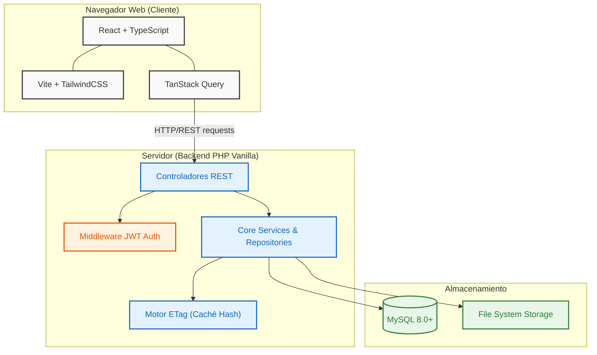

<div align="center">
  
  <h1>☁️ Project Cloud</h1>
  <p><strong>Self-Hosted Cloud Storage & File Manager</strong></p>
  <p>Devuelve el control total de los datos a tu organización. Máxima privacidad, soberanía de información y cero cuotas mensuales.</p>
</div>

---

> [!NOTE]
> **Project Cloud** es una plataforma **Open Source** construida para entornos de alto rendimiento. Ofrece las capacidades de gestión de archivos de las grandes corporaciones, pero hospedado 100% en tu propia infraestructura (VPS, cPanel, Plesk).

## 🚀 ¿Por qué elegir Project Cloud?

| Característica | Descripción |
| :--- | :--- |
| 🛡️ **Privacidad Absoluta** | Mantén todos tus archivos confidenciales en tu servidor. Sin intermediarios, sin minería de datos, sin condiciones ocultas. |
| ⚡ **Rendimiento Extremo** | La plataforma está optimizada para volar. Gracias a un agresivo manejo de cachés (*ETags*), las recargas son casi nulas. |
| 🎨 **Identidad (White-Label)** | Configura tu propio logotipo, tipografía, paleta de colores y nombre corporativo. El sistema se adaptará a tu marca. |
| 🔒 **Seguridad y Auth** | Sistema de autenticación sólido con JWT y Refresh Tokens, manejo de avatares de perfil, y flujos de restablecimiento de contraseña seguros. |
| 💸 **Costos Predecibles** | Olvídate de los modelos de suscripción escalonados. El almacenamiento es ilimitado, dictado únicamente por el disco duro de tu servidor. |

---

## 🏛️ Arquitectura del Sistema

El proyecto combina una interfaz gráfica de última generación con un backend **ligero y robusto**, permitiendo ser montado en casi cualquier servidor web tradicional sin requerir complejos entornos de contenedores o Node.js en producción.



### 📂 Estructura del Monorepo

```text
proyecto-cloud/
├── frontend/        # React + TS + Vite + Tailwind (Screaming Architecture)
├── api/             # API PHP Vanilla en capas (MVC/DDD)
├── database/        # schema.sql (migraciones iniciales)
├── docs/            # Documentación adicional
└── README.md        # Documentación principal
```

### 💻 Frontend (Screaming Architecture)
Desarrollado en **React + TypeScript + Tailwind CSS** bajo el patrón *Screaming Architecture*. Cada módulo de la aplicación (`admin`, `auth`, `drive`, `trash`) reside en su propio contenedor, haciendo el código inmensamente escalable.
- **Caché Inteligente (TanStack Query + ETag):** Redefinimos la velocidad en aplicaciones web. Nuestro cliente intercepta el encabezado `If-None-Match`, permitiendo al servidor responder `304 Not Modified` instantáneamente. El navegador extrae la información completa de la memoria local, eliminando latencias y reduciendo el consumo de red en un 90%.
- **Autenticación (JWT):** Gestión transparente de tokens de acceso y refresco. Restauración de sesión automática, protección de rutas y perfiles avanzados.

### ⚙️ Backend (PHP Layered / MVC)
Creado en **PHP Vanilla** para garantizar portabilidad en servidores económicos o empresariales por igual, sin requerir acceso SSH complejo para desplegar.
- **Diseño en Capas:** Aislamiento perfecto entre `Controllers`, `Middleware`, `Services` y patrón de `Repositories` para la BD.
- **Gestión de Recursos Nativos:** Integración nativa con almacenamiento de archivos, generación en tiempo real de hashes ETag para las colecciones y protección criptográfica robusta de contraseñas y accesos.

---

## 💻 Desarrollo Local

Para trabajar en el código de forma local, el repositorio está dividido en Frontend (React) y Backend (PHP).

```bash
# 1. Clona el repositorio
git clone https://github.com/tu-usuario/project-cloud.git
cd project-cloud

# 2. Instala dependencias del frontend e inicia el servidor de desarrollo
cd frontend
npm install
npm run dev
```

El backend en desarrollo se puede ejecutar utilizando el servidor integrado de PHP:
```bash
cd api
php -S localhost:8000 -t public
```

---

## 🚀 Despliegue en Producción (1 Minuto)

Olvídate de editar archivos de configuración manuales por consola; el sistema lo hace todo por ti gracias a su asistente integrado.

### 1. Compilación del Frontend
Genera la versión optimizada para producción del Frontend ejecutando:
```bash
cd frontend
npm run build
```
Esto generará una carpeta `dist/` con los archivos estáticos listos.

### 2. Subida de Archivos al Servidor
En tu servidor de alojamiento (ej: `public_html` en cPanel/Plesk):
- Sube todo el contenido generado dentro de la carpeta `dist/` a la raíz de tu dominio.
- Sube la carpeta completa `api/` (ubicada en la raíz del repositorio) junto a los archivos del frontend.

### 3. Creación de la Base de Datos
- Desde el panel de tu hosting, crea una **Base de Datos en blanco**.
- Sistemas compatibles: **MySQL 8.0+** o **MariaDB 10.4+**.
- Asegúrate de tener a la mano el Nombre de la base de datos, el Usuario y la Contraseña. ¡No necesitas importar ningún `.sql` manualmente!

### 4. Asistente de Configuración Web
- Visita tu dominio desde el navegador. 
- El instalador gráfico integrado detectará que es una instalación nueva y se iniciará automáticamente.
- Introduce las credenciales de la base de datos vacía que acabas de crear y define tu usuario Administrador inicial.
- ¡Listo! El asistente construirá las tablas, aplicará las migraciones, sembrará las plantillas de correos y reglas `.htaccess` en segundos.

> [!TIP]
> **Requisitos Mínimos del Servidor:** Apache/Nginx (con `mod_rewrite`), PHP 8.1+ (Extensiones: `PDO`, `mbstring`, `curl`, `gd`) y MySQL 8.0+ / MariaDB 10.4+.

---

## 🔮 Roadmap y Funciones Futuras

Seguimos evolucionando para convertirnos en la nube perfecta:
- [ ] Visualizadores avanzados nativos (PDF, Vídeos, Documentos de texto).
- [ ] Permisos granulares de carpetas y enlaces compartidos temporales.
- [ ] Notificaciones en tiempo real (WebSockets / SSE).
- [ ] Aplicaciones móviles (PWA con soporte Offline completo).
- [ ] Actualizaciones automáticas (Over-The-Air) de versión desde el panel de control.

<div align="center">
  <i>Desarrollado con pasión para una nube verdaderamente tuya.</i>
</div>
